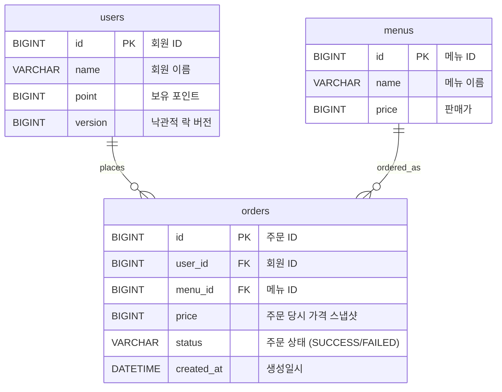

# 커피숍 주문 시스템

다수 서버 환경에서도 안정적으로 동작하는 것을 목표로 설계한 커피 주문 시스템입니다.

## 목차
- [ERD](#erd)
- [API 명세](#api-명세)
- [설계 의도 및 문제 해결 전략](#설계-의도-및-문제-해결-전략)
- [기술적 선택 이유](#기술적-선택-이유)

---

## ERD



**설계 노트**
- `orders.price`는 `menus.price`를 그대로 참조하지 않고 주문 시점 가격을 스냅샷으로 저장합니다. 메뉴 가격이 추후 변경되어도 과거 주문 금액은 그대로 유지되어야 하기 때문입니다.
- `users.version`은 포인트 충전/차감 시 동시 요청 충돌을 감지하기 위한 낙관적 락 버전 컬럼입니다.

---

## API 명세

### 1. 커피 메뉴 목록 조회
```
GET /menus

Response 200
[
  { "id": 1, "name": "아메리카노", "price": 4000 },
  { "id": 2, "name": "카페라떼", "price": 4500 }
]
```

### 2. 포인트 충전
```
POST /points/charge
Request
{ "userId": 1, "amount": 10000 }

Response 200
{
  "userId": 1,
  "beforePoint": 5000,
  "chargedAmount": 10000,
  "afterPoint": 15000
}
```

### 3. 커피 주문/결제
```
POST /orders
Request
{ "userId": 1, "menuId": 3 }

Response 200
{
  "orderId": 100,
  "menuName": "아메리카노",
  "price": 4000,
  "status": "SUCCESS",
  "remainingPoint": 6000
}
```
- 주문이 성공하면, 주문 내역(주문ID·사용자ID·메뉴ID·메뉴명·결제금액·주문상태·주문일시)을 데이터 수집 플랫폼으로 비동기 전송합니다. 전송 성공 여부와 무관하게 주문/결제 응답은 항상 정상적으로 반환됩니다.

### 4. 인기 메뉴 목록 조회
```
GET /menus/popular

Response 200
[
  { "rank": 1, "menuId": 3, "menuName": "아메리카노", "orderCount": 152 },
  { "rank": 2, "menuId": 1, "menuName": "카페라떼", "orderCount": 98 }
]
```
- 최근 7일간 결제가 완료(`SUCCESS`)된 주문만 집계합니다. 실패한 주문은 실제 판매로 이어지지 않았으므로 인기 순위 집계에서 제외해, 순위의 정확성을 보장합니다.

---

## 설계 의도 및 문제 해결 전략

### 동시성 제어: 낙관적 락(Optimistic Lock)
포인트 차감은 여러 요청이 동시에 같은 사용자의 데이터를 수정하려 할 때 정합성이 깨질 수 있는 지점입니다. 비관적 락과 낙관적 락을 함께 검토했습니다.

- **비관적 락**은 매 요청마다 확실하게 순서를 보장하지만, 매번 락을 걸어야 해 처리량 저하가 발생할 수 있습니다.
- **낙관적 락**은 평상시엔 락 없이 처리하다가, 실제 충돌이 발생했을 때만 감지하고 재시도합니다.

한 사용자가 짧은 시간에 여러 주문/충전을 동시에 시도하는 상황은 상대적으로 드물 것으로 예상되어, 낙관적 락(`@Version`)과 재시도 로직(최대 3회)을 선택했습니다. 재시도 시에는 매번 최신 데이터를 다시 조회하므로, 낡은 값으로 재시도하는 문제가 없습니다.

### 데이터 일관성: 트랜잭션 처리
주문/결제는 포인트 차감과 주문 내역 저장이 하나의 단위로 처리되어야 합니다. `@Transactional`로 묶어, 중간에 예외(포인트 부족 등)가 발생하면 전체가 롤백되도록 했습니다. 이에 따라 실패한 주문은 별도 상태로 저장하지 않고, 애초에 저장 자체가 되지 않습니다.

### 실패 주문의 처리
결제 실패 시 별도 로그성 기록을 남기지 않고, 트랜잭션 롤백으로 자연스럽게 처리했습니다. 인기 메뉴 집계 요구사항("주문 횟수가 정확해야 함")을 고려했을 때, 실패 건이 데이터에 남아 집계를 왜곡할 필요가 없다고 판단했습니다.

### 주문 내역 실시간 전송: 비동기 처리 (Fire-and-forget)
데이터 수집 플랫폼 전송은 부가적인 기능으로, 이 처리가 느려지거나 실패하더라도 사용자의 핵심 경험(주문/결제)에 영향을 주면 안 된다고 판단했습니다. 이에 따라 `@Async`로 별도 스레드에서 비동기 처리하고, 전송 실패 시에도 예외를 다시 던지지 않고 로그만 남기도록 구현했습니다. 실제 외부 플랫폼이 없어, 프로젝트 내부에 이를 흉내내는 Mock 엔드포인트를 별도 패키지(`mock`)에 분리해 구현했습니다.

### 계층 구조
Controller-Service-Repository 계층을 명확히 분리했습니다. Controller는 Repository를 직접 참조하지 않고 반드시 Service를 통해서만 데이터에 접근하도록 했습니다. 또한 Entity를 API 응답으로 직접 노출하지 않고 DTO로 변환해, DB 구조 변경이 API 스펙에 그대로 노출되지 않도록 했습니다.

---

## 기술적 선택 이유

| 항목 | 선택 | 이유 |
|---|---|---|
| 동시성 제어 | 낙관적 락 (`@Version`) | 충돌이 드물 것으로 예상되는 트래픽 패턴에 적합, 평시 처리 성능 우수 |
| 예외 처리 | BusinessException + ErrorCode(enum) | 도메인 예외를 Java 기본 예외와 구분해 일관되게 처리 |
| 데이터 전송 | 비동기(`@Async`) + Fire-and-forget | 부가 기능 장애가 핵심 기능에 영향을 주지 않도록 격리 |
| DB (개발 환경) | H2 | 별도 설치 없이 빠른 개발/테스트 가능 |
